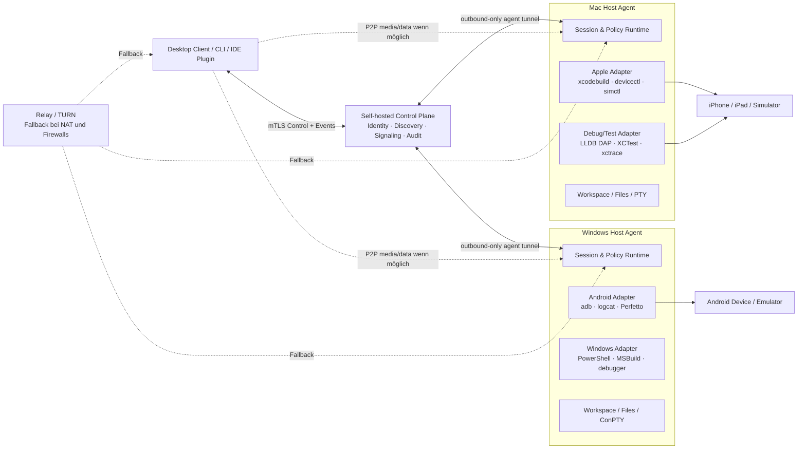

# Device Development Mesh – Systemdesign und Masterplan

Stand: 2026-07-30  
Status: Phase 1 verifiziert; Phase 2 (Mac/iOS) in Umsetzung

## 1. Zielbild

Das System stellt jeden registrierten Entwicklungsrechner als sicheren Host-Agenten bereit. Ein Entwickler kann von Windows, macOS oder später Linux aus Quellcode synchronisieren, Befehle und Builds auf einem anderen Host ausführen, Logs und Debug-Daten streamen und an diesem Host angeschlossene Mobilgeräte oder Simulatoren bedienen.

Der wichtigste vertikale Ablauf ist:

1. Ein Entwickler arbeitet auf Windows.
2. Der Windows-Client öffnet eine Sitzung mit einem Mac-Agenten.
3. Quellcode wird in einen isolierten Workspace auf dem Mac übertragen oder dort ausgecheckt.
4. Der Mac baut und signiert die iOS-App mit Xcode.
5. Der Mac installiert und startet sie auf einem angeschlossenen iPhone.
6. Konsole, Tests, Screenshots, Crashlogs, Debugger- und Performance-Artefakte fließen zurück nach Windows.
7. Zulässige UI-Aktionen werden über XCTest/XCUIAutomation ausgeführt.

Das Gegenstück Mac → Windows → Android/Windows-App folgt demselben Protokoll und tauscht nur die Host- und Device-Adapter aus.

## 2. Realistische Produktgrenze

„Vollzugriff“ bedeutet vollständiger Zugriff auf die freigegebenen Entwicklungsfunktionen eines Hosts, nicht das Umgehen von Betriebssystem-Sicherheitsmodellen.

- iOS besitzt keine öffentliche ADB-Entsprechung für beliebige Systemsteuerung. Garantiert werden Entwickleraktionen für gekoppelte Geräte und eigene Development-Apps über Xcode-Werkzeuge sowie App-UI-Automation über XCTest/XCUIAutomation.
- Eine beliebige Fernbedienung des iOS-Homescreens, fremder Apps, sicherer Dialoge, Kamera, Mikrofon oder biometrischer Prompts wird nicht versprochen.
- Apple-Builds, Codesigning und physische iOS-Geräte bleiben an einen Mac mit vollständigem Xcode gebunden.
- Android kann über ADB wesentlich breiter bedient werden, bleibt aber ebenfalls durch Gerätezustand, Developer Options, Pairing und gegebenenfalls Root-Grenzen beschränkt.
- Der Agent bietet keinen anonym erreichbaren Root-Shell-Dienst. Erweiterter Shell-/Adminzugriff ist ein explizites Capability-Profil mit lokaler Freigabe, Ablaufzeit und Audit.

Offizielle Plattformgrundlagen:

- Apple Xcode CLI (`xcodebuild`, `devicectl`, `simctl`, `xcresulttool`, `xctrace`): https://developer.apple.com/documentation/xcode/xcode-command-line-tool-reference
- Apple UI-Tests mit XCTest/XCUIAutomation: https://developer.apple.com/documentation/xctest/
- Android Debug Bridge: https://developer.android.com/tools/adb
- Windows OpenSSH: https://learn.microsoft.com/windows-server/administration/openssh/openssh-overview
- Apple iPhone Mirroring und Einschränkungen: https://support.apple.com/120421

## 3. Bewertete Lösungsansätze

### A. SSH-Fassade

Jeder Host stellt SSH, Dateitransfer und Skripte bereit. Das ist schnell prototypisierbar, aber Geräteerkennung, Berechtigungen, strukturierte Logs, Sitzungsfortsetzung und plattformübergreifende Semantik bleiben uneinheitlich. Ein Web- oder Desktop-Client müsste Shell-Ausgaben erraten. Geeignet als Break-glass-Fallback, nicht als Produktkern.

### B. Remote Desktop plus IDE-Streaming

Der Benutzer bedient den entfernten Mac oder Windows-Rechner visuell. Das deckt exotische Werkzeuge ab, ist aber latenzempfindlich, schlecht automatisierbar und liefert keine stabile API für CI, Agenten oder reproduzierbare Debug-Abläufe. Geeignet als ergänzende Escape-Hatch-Funktion.

### C. Capability-basierter Agenten-Mesh – empfohlen

Ein gemeinsames, versioniertes Protokoll beschreibt Hosts, Geräte, Builds, Dateien, Prozesse, Tests, Logs, Debugger und Artefakte. Plattformadapter übersetzen diese Operationen in Xcode-, ADB-, PowerShell-, MSBuild- oder Linux-Werkzeuge. Interaktive Bild-/Eingabeströme sind ein separater Kanal. Das ist aufwendiger, aber sicher, testbar, erweiterbar und für CLI, Desktop-UI, IDE und CI gleichermaßen nutzbar.

Entscheidung: Ansatz C als Kern; SSH und Remote Desktop nur als klar markierte Fallbacks.

## 4. Systemarchitektur

### 4.1 Komponenten

1. **Host Agent**: signierter Dienst für Windows/macOS; meldet nur tatsächlich verfügbare Capabilities, verwaltet Workspaces, Prozesse, PTYs, Geräte und exklusive Leases.
2. **Controller Core**: gemeinsame Bibliothek für CLI und Tauri-Desktop-App; validiert Protokoll, stellt Sitzungen wieder her und speichert keine entfernten Secrets.
3. **Control Plane**: selbst hostbar; Registrierung, Public Keys, Discovery, Signaling, Policy-Metadaten und Audit. Alle Agent-Verbindungen sind ausgehend, damit keine offenen Host-Ports nötig sind.
4. **Direkt-/Relay-Datenebene**: direkte verschlüsselte Verbindung bevorzugt; Relay bei NAT/Firewall. Bildschirm/Audio später über WebRTC; Befehle, Logs und Dateien über versionierte bidirektionale RPC-Streams.
5. **Adapter-SDK**: stabile Capability-Interfaces; Apple, Android, Windows und später Linux sind getrennte Pakete und können unabhängig getestet werden.
6. **Workspace Engine**: Git-Checkout oder inhaltsadressierte Delta-Synchronisierung in isolierte Sitzungsverzeichnisse; keine unkontrollierte Spiegelung des Benutzerprofils.
7. **Artifact Store**: Buildprodukte, `.xcresult`, Crashlogs, Screenshots, Videos, Traces und Bugreports mit Hash, Größe, MIME-Typ und Ablaufzeit.

### 4.2 Technologiewahl

- Rust stable für Agent, Controller Core, CLI, Broker und Adapter-SDK: statische Binärdateien, kontrollierbarer Ressourcenverbrauch und gute Windows/macOS-Systemintegration.
- Protocol Buffers mit gRPC/HTTP2 für versionierte Control- und Event-APIs; WebRTC nur für latenzkritische Medien-/Eingabekanäle.
- Tauri 2 + TypeScript/React für die Desktop-Oberfläche, nachdem der CLI-Vertikalschnitt stabil ist.
- SQLite lokal für Hostzustand und Audit-Queue; PostgreSQL optional im Control Plane für Mehrbenutzerbetrieb.
- OpenTelemetry-kompatible Traces und strukturierte JSON-Events.
- DAP für Debugger-Transport und LSP-Forwarding als spätere, getrennte Erweiterung.

## 5. Capability-Modell

Jede Operation besitzt `capability`, `target`, `scope`, `risk`, `lease`, `request_id` und `audit_context`. Ein Agent veröffentlicht zum Beispiel `apple.device.install@1`, nicht nur „shell vorhanden“.

### 5.1 Host-Basis

- Hostinventar: OS, Architektur, Toolchain-Versionen, freie Ressourcen, Netzwerkqualität.
- Prozess: starten, stoppen, Exitcode, stdout/stderr, Signale, Zeitlimit.
- Terminal: PTY/ConPTY, Resize, UTF-8, Umgebungsprofil, Reconnect.
- Dateien: Manifest, Delta-Push/Pull, Hashprüfung, Resume, Ignore-Regeln, Konfliktmeldung.
- Workspace: Git-Clone/Fetch/Worktree, Snapshot, Cleanup, Quota, exklusive Schreibsitzung.
- Ports: explizite Forward-/Reverse-Tunnel pro Sitzung.
- Build/Test: Job, Abbruch, strukturierte Phasen, Artefakte, Cache-Schlüssel.
- Debug: DAP-Verbindung, Symbolpfade, Breakpoints, Attach/Launch.

### 5.2 Apple-Adapter auf macOS

- Xcode-/SDK-/Runtime-Erkennung und `xcode-select`-Prüfung.
- Physische Geräte: auflisten, Pairing-/Trust-Zustand anzeigen, Developer Mode/Support prüfen.
- Simulatoren: erstellen, booten, löschen, Status, Standort, Medien und Permissions via `simctl`.
- Build/Archive/Test über `xcodebuild`; Ziele, Schemes, Configurations und Destinations entdecken.
- Development-App installieren, starten, beenden und deinstallieren über `devicectl`.
- Device-/App-Logs, Crashreports und Diagnosedaten streamen bzw. als Artefakt exportieren.
- XCTest/Swift Testing ausführen; `.xcresult` mit `xcresulttool` normalisieren.
- App-UI über XCTest/XCUIAutomation: Tap, Text, Swipe, Elementabfrage, Screenshot, Testplan.
- LLDB/Xcode-Debugsession über einen kontrollierten Adapter; Debugserver nie öffentlich exponieren.
- Instruments/`xctrace`: CPU, Memory, Energy, Network und Signposts erfassen.
- Codesigning: Identitäten und Profile nur referenzieren; private Schlüssel verbleiben im macOS Keychain.
- App-Containerzugriff nur für zulässige Development-Apps und dokumentierte Toolpfade.

### 5.3 Android-Adapter auf Windows/macOS/Linux

- Eigener oder konfigurierter ADB-Server; USB und Android-11+-Wireless-Pairing.
- Geräte/Emulatoren entdecken, Eigenschaften und Autorisierungsstatus anzeigen.
- APK/App Bundle bauen, installieren, upgraden, deinstallieren, starten, stoppen, clear-data.
- Shell, Activity/Intent, Eingabe, Screenshot, Screenrecord, Pull/Push, Port Forward/Reverse.
- Logcat als strukturierter Stream mit Filter, Cursor und Reconnect.
- Instrumentation, Gradle Tests, UI Automator/Espresso und Testergebnisse.
- JDWP/DAP-Bridge, native Debugger-Weiterleitung, Symbol- und Source-Mapping.
- Bugreport, ANR, Tombstones soweit autorisiert, Perfetto und Profiling-Artefakte.
- Root-spezifische Aktionen separat erkennen und standardmäßig deaktivieren.

### 5.4 Windows-Adapter

- PowerShell 7 bevorzugt, Windows PowerShell klar gekennzeichnet; ConPTY für interaktive Shells.
- MSBuild, `dotnet`, CMake/Ninja, Node und weitere deklarative Toolchains.
- Windows-App starten/stoppen, Event Logs, Dumps, ETW/Performance Recorder.
- Visual-Studio-Debugger oder `vsdbg`/DAP, abhängig vom Projekttyp.
- UI-Automation über Windows UI Automation/Appium-Adapter als separates Modul.
- Dienste oder Adminoperationen nur über elevierte, lokal bestätigte Capabilities.

### 5.5 macOS-/Linux-Hostfunktionen

- macOS-App-Build, Test, Launch, Logs, LLDB und Instruments analog zum Apple-Adapter.
- Linux-Agent für Server-, Container-, Web- und Android-Builds; systemd/journalctl/Containeradapter erst nach dem Kern-MVP.

## 6. Vollständige Szenario-Matrix

| Ausgang | Ausführungshost | Ziel | Kernablauf | Supportziel |
|---|---|---|---|---|
| Windows | Mac | iPhone per USB/WLAN | Sync → Xcode Build/Sign → Install → Launch → Logs/Test/Debug | primär |
| Windows | Mac | iOS Simulator | Sync → Build → Boot → Install → UI-Test → xcresult | primär |
| Mac | Windows | Android per USB/WLAN | Sync → Gradle → ADB Install/Launch → Logcat/Debug | primär |
| Mac | Windows | Windows-App | Sync → MSBuild/dotnet → Launch → Logs/DAP | primär |
| Windows | Mac | macOS-App | Sync → Xcode Build/Test → Launch → LLDB/Instruments | primär |
| Mac | Linux | Web/Backend/Container | Sync → Build/Test → Portforward → Logs | sekundär |
| Windows | Linux | Android/Backend | Gradle/ADB oder Serverworkflow | sekundär |
| beliebig | gleicher Host | lokales Gerät | identisches Protokoll ohne Relay | primär |
| IDE/CLI | CI-Host | Gerätefarm | nicht-interaktive Jobs, Artefakte, Lease-Queue | später |

Zusätzlich abzudecken:

- Mehrere Hosts pro Benutzer und mehrere Geräte pro Host.
- Ein Gerät exklusiv in einer aktiven Schreib-/Debugsitzung; Beobachter dürfen Logs lesen.
- LAN ohne Internet über mDNS + direkte Pairing-Codes.
- WAN über Control Plane und Relay, ohne eingehende Firewall-Freigabe.
- Wechsel LAN ↔ WAN ohne Verlust der Job-ID; Streamresume ab Sequenznummer.
- Host schläft, verliert Strom, wechselt IP oder aktualisiert Xcode/ADB.
- Gerät wird getrennt, gesperrt, nicht vertraut, Developer Mode fehlt oder ist belegt.
- Build läuft weiter, obwohl der Controller kurz offline ist; Status wird nach Reconnect nachgeliefert.
- Parallele Builds mit Ressourcenlimits; Device-Leases bleiben exklusiv.
- Große Repositories und Binärartefakte mit Delta-Sync, Resume, Quota und LRU-Cleanup.
- Mono- und Multi-Repo-Projekte; Git-Submodule und LFS werden explizit erkannt.
- Unicode-, Leerzeichen- und lange Windows-Pfade; unterschiedliche Groß-/Kleinschreibung.
- Unterschiedliche Toolchainversionen; Anforderungen werden vor Jobstart gegen Capabilities geprüft.
- Secrets, Zertifikate und Provisioning verbleiben auf dem Ausführungshost.
- Offline-Abbruch, Timeout, Benutzerabmeldung, Agent-Upgrade und Protokollversionskonflikt.
- Auditexport und sichere Löschung abgelaufener Workspaces/Artefakte.

## 7. Sicherheitsmodell

### 7.1 Identität und Pairing

- Jeder Agent erzeugt ein nicht exportierbares Geräteschlüsselpaar in Keychain, DPAPI/CNG oder Linux Secret Service.
- Erstregistrierung über kurzlebigen QR-/Pairing-Code mit beidseitiger Fingerprint-Anzeige.
- Danach kurzlebige Sitzungszertifikate; mTLS auf jedem Control-/Datenkanal.
- Optional OIDC/SSO für Teams; lokale Pairings funktionieren ohne Cloud.

### 7.2 Autorisierung

- Capability-Profile: `observer`, `developer`, `device-operator`, `admin-break-glass`.
- Ziel-, Workspace-, Projekt- und Geräte-Scopes; deny-by-default.
- Zeitlich begrenzte Device- und Workspace-Leases.
- Destruktive Aktionen wie App-Daten löschen, Deinstallieren, Prozess-Kill außerhalb des Workspaces oder Admin-Shell sind separat klassifiziert.
- Lokale Zustimmungsanzeige am Host für neue Geräte, neue Benutzer und Break-glass; bestehende Development-Policies dürfen Routinejobs automatisch erlauben.

### 7.3 Isolation und Audit

- Agent läuft unprivilegiert; ein minimaler privilegierter Helper besitzt eine feste, enge API.
- Befehle erhalten kein frei vererbtes Benutzer-Environment; Secrets werden gezielt injiziert und in Logs redigiert.
- Workspace-Pfade werden kanonisiert; Symlink/Junction-Escapes werden geblockt.
- Jede Operation bekommt Request-ID, Actor, Capability, Ziel, Zeit, Ergebnis und Artefakthashes.
- Keine Bildschirm-/Audioaufzeichnung ohne sichtbare Sessionanzeige; standardmäßig keine persistente Speicherung.
- Signierte Updates, Rollback-Schutz, SBOM, Abhängigkeits- und Secret-Scanning vor Releases.

## 8. Datenflüsse

### 8.1 Build auf entferntem Mac und Start auf iPhone

1. Controller fordert `workspace.open` und `apple.device.lease` an.
2. Agent prüft Policy, Toolchain und Gerätezustand.
3. Workspace Engine synchronisiert nur geänderte Inhalte und bestätigt den Manifesthash.
4. `apple.build` startet `xcodebuild` mit strukturiertem Jobkontext.
5. stdout/stderr und Buildphasen werden als sequenzierte Events gestreamt.
6. Buildprodukt und `.xcresult` werden gehasht und registriert.
7. `apple.device.install` und `apple.device.launch` verwenden die konkrete Device-ID.
8. Logs, Debugger oder XCTest laufen als untergeordnete Sessions.
9. Controller lädt ausgewählte Artefakte herunter; Lease und Workspace werden beendet oder behalten.

### 8.2 Reconnect

Der Job gehört dem Host-Agenten, nicht der TCP-Verbindung. Der Controller sendet nach Reconnect `last_seen_sequence`; der Agent liefert gepufferte Events nach und setzt Live-Streaming fort. Nicht idempotente Operationen verwenden Request-IDs und Ergebnisjournale, damit ein Retry keine zweite Installation oder Löschung auslöst.

## 9. Fehler- und Grenzfälle

- **Vorbedingung fehlt**: maschinenlesbarer Fehler mit Repair-Hinweis, zum Beispiel Xcode nicht aktiv, iPhone nicht vertraut oder ADB unauthorized.
- **Capability drift**: Agent publiziert nach Toolchainupdate einen neuen Snapshot; inkompatible Jobs starten nicht.
- **Gerät getrennt**: Job wechselt auf `waiting_for_device` mit begrenztem Timeout, statt blind weiterzulaufen.
- **Controller getrennt**: nicht-interaktive Builds laufen weiter; interaktive Eingaben pausieren sicher.
- **Agent-Neustart**: persistierte Jobjournale werden als `interrupted` oder fortsetzbar rekonstruiert.
- **Doppelte Requests**: idempotency key liefert das vorhandene Resultat.
- **Dateikonflikt**: kein Last-writer-wins; Sync stoppt mit Baseline-, Local- und Remote-Hash.
- **Zu wenig Speicher**: Preflight mit benötigtem Budget; Cleanup nur innerhalb agent-eigener Verzeichnisse.
- **Codesigningfehler**: normalisierte Kategorie plus unverändertes geschütztes Rohlog als Artefakt.
- **Missbrauch/Anomalie**: Rate Limits, Sitzungsentzug und lokaler Kill Switch.

## 10. Qualitäts- und Leistungsziele

- LAN Control-RPC p95 unter 150 ms; WAN ohne Medien p95 unter 500 ms bei stabiler Verbindung.
- Logevent-Anzeige p95 unter 500 ms LAN und unter 1,5 s WAN.
- Reconnect-Erkennung innerhalb 5 s; Eventresume ohne Lücke für mindestens 10.000 Events oder 50 MiB pro Job.
- 1-GiB-Dateiübertragung wiederaufnehmbar; nach Verbindungsabbruch werden nur fehlende Chunks übertragen.
- Agent Idle-RAM unter 100 MiB je Host; Control Plane ohne aktive Medien unter 256 MiB für einen Einzelbenutzer.
- Kein unverschlüsselter Netzwerkverkehr; keine Langzeit-Tokens in Klartextdateien.
- Protokollkompatibilität mindestens aktuelle und vorherige Minor-Version.
- Alle Kernoperationen besitzen Contract-, Policy-, Fault-injection- und Ende-zu-Ende-Tests.

## 11. Lieferphasen

### Phase 0 – Feasibility Gates

- Reale Kommandoausgaben von aktuellem Xcode/devicectl/simctl und ADB erfassen und Parserverträge einfrieren.
- Auf einem Mac den Ablauf Build → Install → Launch → Log → XCTest auf physischem iPhone beweisen.
- Auf Windows den Ablauf Build → ADB Install → Launch → Logcat beweisen.
- NAT/Relay-, PTY/ConPTY- und 1-GiB-Resume-Spikes messen.

Phase 0 kann parallel zum plattformneutralen Kern aus Phase 1 laufen, muss aber vor Beginn der jeweiligen nativen Adapterphase abgeschlossen sein. Fehlt echte Mac-/iPhone- oder Android-Hardware, blockiert das nicht Phase 1, wohl aber jede Aussage, Phase 2 oder 3 sei unterstützt.

### Phase 1 – Sicherer vertikaler Kern

- Rust Workspace, Protokoll, Host-Agent, CLI, lokaler Broker, Pairing, Policy, Leases, Workspace, Prozess- und Eventstreams.
- Simulierte Apple-/Android-Adapter für plattformunabhängige CI.
- Ein Ende-zu-Ende-Test steuert von einem Client einen getrennten lokalen Agentprozess.

### Phase 2 – Mac/iOS Development

- Xcode Discovery, Build/Test, Simulatoren, physische Geräte, Installation/Launch, Logs, xcresult, LLDB und xctrace.
- Hardware-in-the-loop-Testmatrix auf Mac + iPhone.

### Phase 3 – Android Development

- ADB USB/Wireless, Gradle, App-Lifecycle, Logcat, Dateien/Ports, Tests, JDWP und Perfetto.
- Hardware-in-the-loop auf Windows, macOS und Linux.

### Phase 4 – Windows/macOS App Development

- MSBuild/dotnet/Windows-Debugging und macOS-App-Workflows; plattformspezifische UI-Automation.

### Phase 5 – Interaktive UX

- Tauri Desktop-App, Geräte-/Host-Dashboard, Terminal, Logviewer, Artefakte und Debugansicht.
- WebRTC-Bildschirmkanal und zulässige Eingabeadapter; Remote Desktop nur als optionaler Fallback.

### Phase 6 – WAN, Teams und Produktion

- Self-hosted Control Plane, Relay/TURN, OIDC, Team-RBAC, Auditexport, Quotas, signierte Auto-Updates, Installer und Recovery.

### Phase 7 – IDE und CI

- VS Code/JetBrains-Integration, DAP/LSP-Forwarding, headless CLI, CI-Runner und Gerätewarteschlangen.

Jede Phase erhält eine eigene freigegebene PRD und einen eigenen Yoke-Loop. Dadurch bleibt jede Story in einer Agentiteration lieferbar und die Hardware-Gates werden nicht durch Mocks als „fertig“ markiert.

## 12. Teststrategie

- **Protocol contracts**: Golden Protobuf payloads, Versionskompatibilität und Fuzzing.
- **Policy tests**: deny-by-default, Scope-Escapes, Lease-Rennen, Revoke während laufender Jobs.
- **Adapter contract suites**: identische Tests gegen Fake-, Apple-, Android- und Windows-Adapter.
- **Parser fixtures**: anonymisierte reale Toolausgaben über mehrere Xcode-/ADB-Versionen.
- **Fault injection**: Paketverlust, Reconnect, Prozesscrash, Disk full, Device detach, doppelte Requests.
- **Security tests**: Path traversal, Symlink/Junction escape, command injection, secret leakage, replay und downgrade.
- **Cross-platform CI**: Windows, macOS, Linux; Hardwaretests separat und als erforderlich für Adapter-Releases.
- **End-to-end**: Client → Broker → Agent → Fake Device; danach dieselben Szenarien mit echten Geräten.
- **Performance**: RPC-Latenz, Logdurchsatz, Chunkresume, CPU/RAM und mehrere parallele Builds.

## 13. Nicht-Ziele des ersten Loops

- Keine fertige Desktop-GUI.
- Kein ungeprüfter Raw-USB-over-IP-Tunnel.
- Keine Umgehung von iOS-Sicherheits-, Signing- oder Trust-Grenzen.
- Keine öffentliche Cloud/SaaS-Abrechnung.
- Kein vollwertiger Remote-Desktop-Server.
- Keine Behauptung, physische Apple-/Android-Hardware sei getestet, solange die jeweilige Hardware-Gate-Suite nicht grün ist.

## 14. Freigabekriterium für den ersten Yoke-Loop

Nach Freigabe implementiert der erste Loop ausschließlich Phase 1. Er darf Phase 2–7 nicht vorziehen. Fertig ist Phase 1 erst, wenn ein CLI-Client mit echtem TLS/Pairing einen separaten Agentprozess entdeckt, eine policy-geprüfte Workspace-Operation ausführt, Logs mit Reconnect empfängt und Fake-Device-Capabilities unter Windows/macOS/Linux über dieselben Contract-Tests anspricht.

### Phase-1-Audit vom 30. Juli 2026

Der erste Loop markierte mehrere Stories trotz fehlender story-spezifischer Implementierung als bestanden, weil das globale Gate nur die bereits vorhandenen Workspace-Tests ausführte. Die Reparaturstories STORY-13 bis STORY-20 ersetzen deshalb den formalen Abschluss: jede Story benennt eine konkrete Testsuite oder einen Bootstrap-Smoke-Test, und Phase 2 beginnt erst nach einem realen Mehrprozess-Vertikalschnitt. Frühere `passes`-Werte sind keine Evidenz für Hardware- oder Netzwerkunterstützung.

## 15. Freigegebener Phase-2-Loop – Mac/iOS

Phase 2 implementiert den Apple-Adapter hinter dem bereits policy- und lease-geschützten Adaptervertrag. Plattformunabhängige CI verwendet versionierte, anonymisierte Toolausgaben; sie beweist Parser, Befehlsplanung, Fehlersemantik und Netzwerktransport. Sie darf den Hardwarestatus nicht auf bestanden setzen.

Die Ausführung erfolgt in dieser Reihenfolge:

1. Apple-Preflight und eine shell-freie, typisierte Toolausführung für `xcodebuild` und `xcrun`.
2. Normalisierte Erkennung physischer Apple-Geräte und Simulatoren.
3. Xcode-Projekt-, Scheme-, Configuration- und Destination-Erkennung.
4. Build/Test mit DerivedData-Isolation, Eventstream und registrierten `.app`-/`.xcresult`-Artefakten.
5. Simulator-Lifecycle, App-Lifecycle und freigegebene Automationsoperationen.
6. Physischer iPhone-App-Lifecycle und Logs über `devicectl`.
7. XCTest/XCUI-Ausführung und normalisierte Ergebnisartefakte.
8. Kontrollierte LLDB-/`xctrace`-Sessions ohne öffentlich exponierten Debugport.
9. Idempotenter Ein-Befehl-Mac-Bootstrap als Benutzer-LaunchAgent einschließlich Diagnosebundle.
10. Reales Hardware-Gate mit einem angeschlossenen iPhone. Erst dieses Gate darf Phase 2 als Hardware-unterstützt ausweisen.

### Phase-2-Integrationsaudit

Die erste Apple-Implementierungsfolge hat Parser, Befehlsplanung, Adapter und
Bootstrap isoliert geliefert, aber noch nicht durch den echten
Registry-Agent-Transport verbunden. Ein lokaler Bibliothekstest ist keine
Evidenz dafür, dass ein Windows-Client tatsächlich Xcode oder ein iPhone am Mac
steuern kann. Vor dem Hardware-Gate sind deshalb vier verbindliche
Vertikalschnitt-Stories eingefügt:

1. Ein versionierter Remote-Apple-Jobvertrag ohne Raw-Shell-Fluchtweg und mit
   sofortiger Jobannahme für lange Builds.
2. Agentseitiger Dispatch samt dynamischer Apple-Capabilities und erneuter
   Policy-, Lease-, Workspace- und Geräteprüfung.
3. Begrenzter, hash-geprüfter und fortsetzbarer Binärartefakttransport über den
   authentisierten Mesh-Kanal.
4. Ein echter Mehrprozess-E2E-Test mit Registry, Mac-Agent, zwei Clients,
   Fake-Apple-Tools, Reconnect und Konkurrenz um Geräte-Leases.

Erst danach folgt das reale Mac-/iPhone-Gate. Der Mac-Bootstrap nimmt eine
explizite Controller-Adresse an, paart bei der Erstinstallation automatisch und
verbindet den LaunchAgent anschließend mit dem entfernten Registry-Port.

Auditnachtrag: Eine erste STORY-31-Umsetzung bestand nur aus
`RemoteAppleRegistry` und `RemoteAppleAgent` im selben Testprozess. Sie gilt
nicht als Remote-Dispatch. Die Abnahme startet zwingend alle drei öffentlichen
Binaries, nutzt den mTLS-Socketvertrag und weist den Ausführungsort mit einem
Agent-Workspace-Marker nach.

Nicht-Ziele dieses Loops bleiben allgemeine iOS-Systemfernsteuerung, Steuerung fremder Apps, Umgehung von Signing/Trust/Developer Mode sowie eine Desktop-GUI. Private Signing-Schlüssel verlassen niemals den macOS-Keychain. Der Nutzer wird erst eingebunden, wenn Bootstrap und Hardware-Gate als ein konkreter Mac-Befehl bereitstehen.
